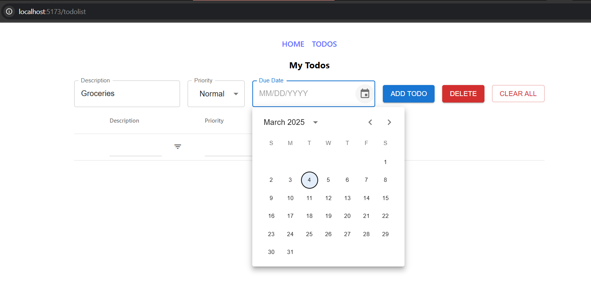
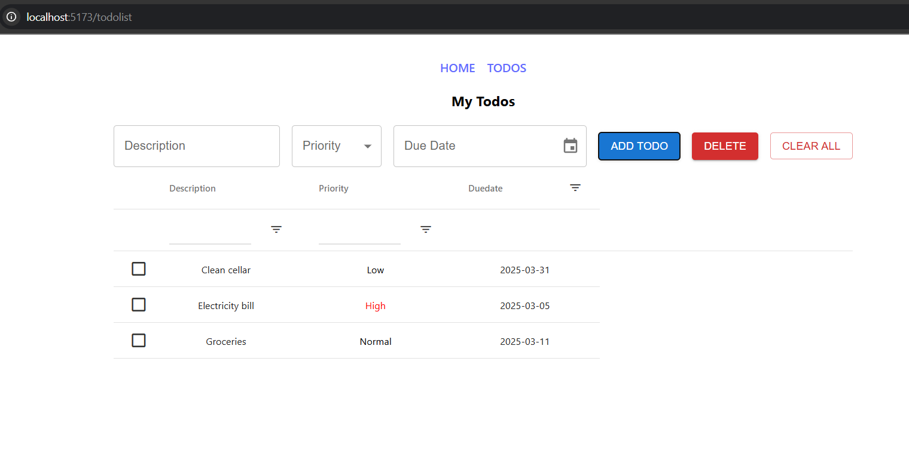

# React Todo Application

A task management web application built with React, Material UI, and AG-Grid. This project demonstrates modern React development practices including component organization, state management, and routing.

## Features

- Add, edit, and delete tasks
- Set priority levels (High, Normal, Low)
- Assign due dates to tasks
- Filter and sort tasks
- Responsive design with Material UI components
- Data display with AG-Grid

## Technologies Used

- React 18
- React Router v6 for navigation
- Material UI for styled components
- AG-Grid for table display
- Day.js for date handling
- Vite as build tool
- Vitest for testing

## Screenshots


_Add todo view of the application_


_Todo management interface with filtering options_

## Installation and Setup

```bash
# Clone the repository
git clone https://github.com/your-username/todolist.git

# Navigate to project directory
cd todolist

# Install dependencies
npm install

# Start development server
npm run dev
```

Visit `http://localhost:5173` to view the application in your browser.

## Testing

This project includes unit tests for components using Vitest and React Testing Library.

```bash
# Run tests
npm test

# Run tests with coverage report
npm run coverage
```

## Project Structure

- `src/components/` - React components
- `src/assets/` - Static assets
- `src/tests/` - Test files

## Learning Goals Achieved

This project was developed as part of my Full Stack Software Development studies at Haaga-Helia University of Applied Sciences, focusing on:

- Building React applications with hooks
- Implementing routing with React Router
- Using Material UI for consistent styling
- Data grid implementation with AG-Grid
- Form handling and validation
- Unit testing React components

## License

This project is open source and available under the [MIT License](LICENSE).
